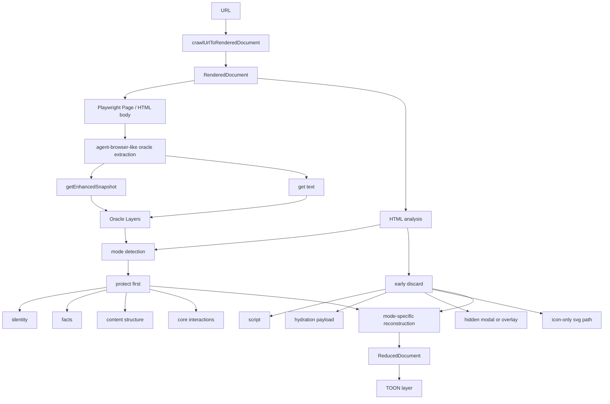

# Agent-Browser-Like Pruning

> Status note (2026-03-19): see `review.md` for the earlier blocker review and `acceptance.md` for the current accepted review.

## Goal

Build a pruning system that preserves the information structure most aligned with `agent-browser`, rather than preserving raw HTML.

The target is no longer:

- "make HTML smaller"

The target is now:

- preserve the information that `agent-browser snapshot` and `agent-browser get text` expose to an agent
- reconstruct a compact reduced document that still contains the key content, structure, facts, and interaction meaning

## Core Direction

- `script` and hydration/runtime payloads are still early-discard candidates
- `class` / `role` / `aria-*` remain valuable hints during pruning
- output should be a structured reduced document, not lightly-cleaned raw HTML
- the reduced document should keep:
  - identity
  - facts
  - structure
  - content
  - interactions

## Diagram



## ReducedDocument Shape

```ts
type ReducedDocument = {
  url: string;
  finalUrl: string;
  fetchedAt: string;
  title: string;
  mode:
    | "place-detail"
    | "map-view"
    | "forum-qna"
    | "docs"
    | "package-page"
    | "marketing-media"
    | "generic";
  identity: string[];
  facts: string[];
  structure: string[];
  content: string[];
  interactions: string[];
};
```

## Implementation Principle

This feature should be built as a reconstruction pipeline:

1. detect mode
2. extract oracle-preserved layers
3. discard known noise
4. reconstruct a compact semantic document

Not as:

1. delete tags
2. hope the remaining HTML is good enough

## Acceptance Rule

The implementation is not considered done until a `gpt-5.4` review worker opens raw/pruned samples in BrowserOS and returns `ACCEPT`.
