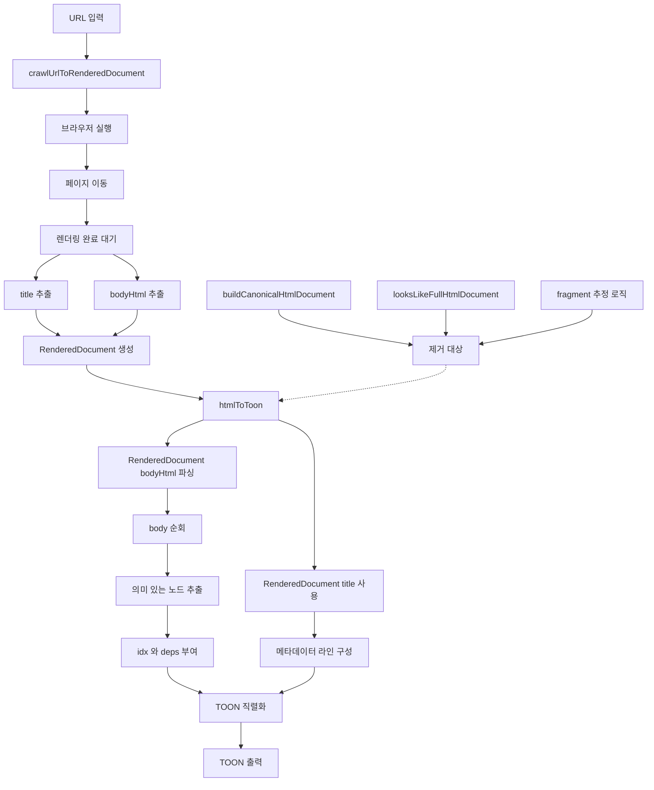
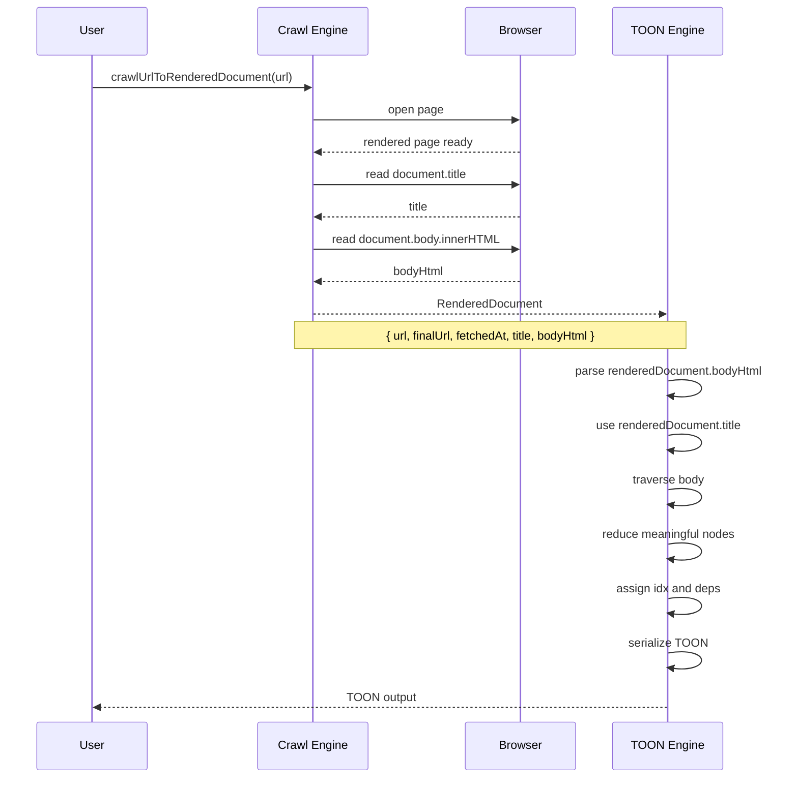

# Crawl To Canonical HTML Design

## Goal

Move the system boundary earlier than `htmlToToon`.

Instead of letting `htmlToToon` guess whether its input is a full HTML document or a fragment, the crawler/rendering layer must always produce a fixed intermediate contract:

- `url`
- `finalUrl`
- `fetchedAt`
- `title`
- `bodyHtml`

Then the TOON engine consumes that `RenderedDocument` directly.

This removes heuristic parsing such as `looksLikeFullHtmlDocument` from the TOON layer and avoids introducing a separate canonical-HTML assembly layer before it is truly needed.

## Architecture Flow



## Sequence Flow



## Responsibility Split

- Crawl Engine
  - owns page loading and render timing
  - extracts `title` and `bodyHtml`
  - produces `RenderedDocument`

- TOON Engine
  - consumes `RenderedDocument` directly
  - uses crawler-provided `title` and `bodyHtml`
  - never guesses fragment vs full document
  - focuses only on reduction and serialization

## RenderedDocument Shape

```ts
type RenderedDocument = {
  url: string;
  finalUrl: string;
  fetchedAt: string;
  title: string;
  bodyHtml: string;
};
```

## Design Consequence

After this boundary is adopted:

- `htmlToToon` should accept `RenderedDocument`
- `htmlToToon` should not contain `looksLikeFullHtmlDocument`
- `buildCanonicalHtmlDocument` is not part of the MVP path
- crawler output becomes the only supported upstream contract
