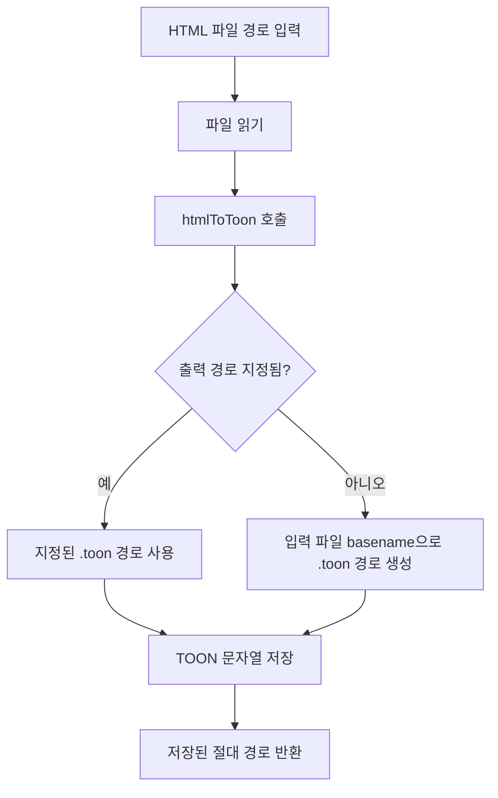
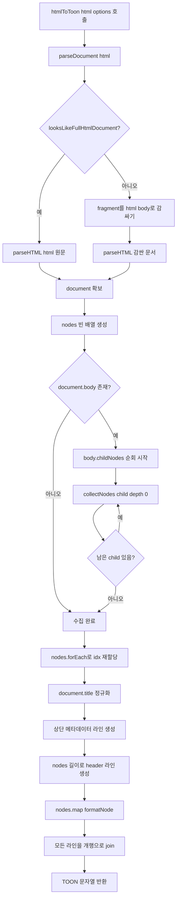
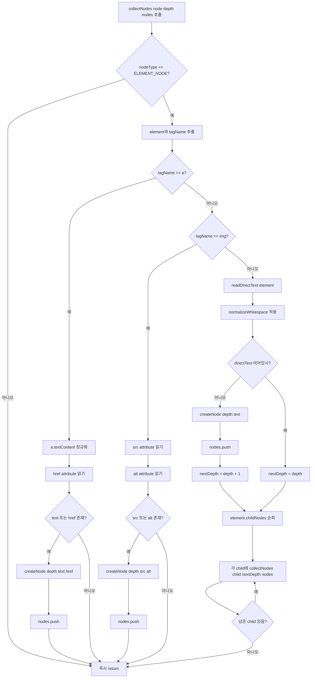
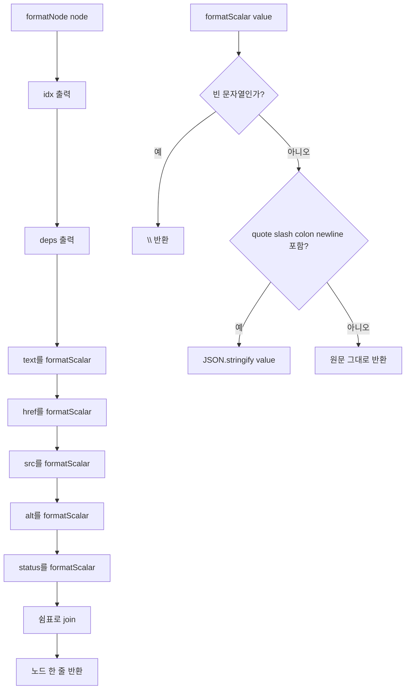
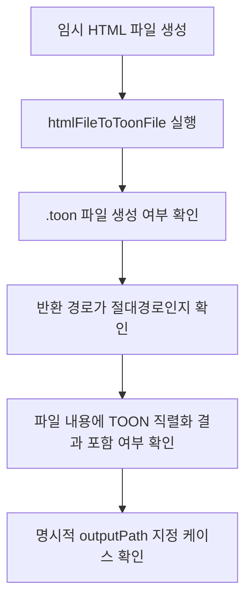

# HTML File To TOON MVP Design

## Goal

Add the thinnest possible file-based layer on top of the existing `htmlToToon` function:

- read a local HTML file
- convert it to TOON
- save the `.toon` result to disk
- return the saved absolute path

## Mermaid Diagram

## Detailed htmlToToon Call

## Detailed collectNodes Flow

## Detailed Serialization Flow

## Test Flow

## Scope

This design intentionally does not include:

- URL fetching
- browser rendering
- cache policy
- CLI command parsing
- failure-node design beyond basic file IO errors
